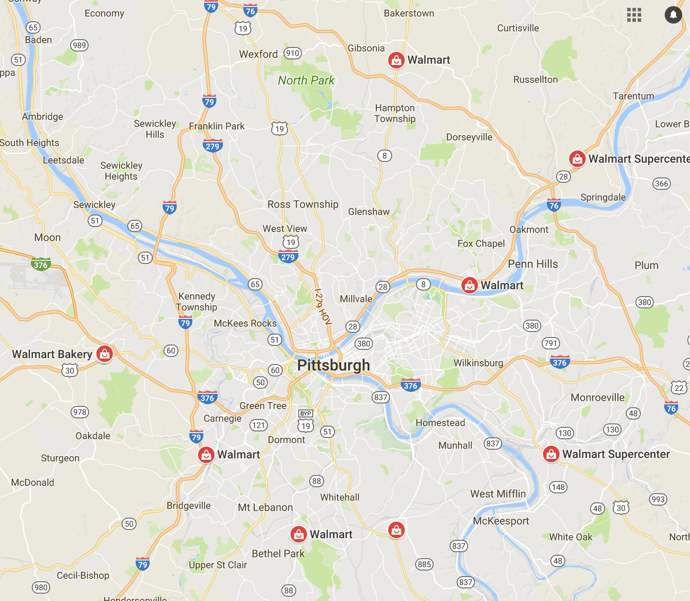
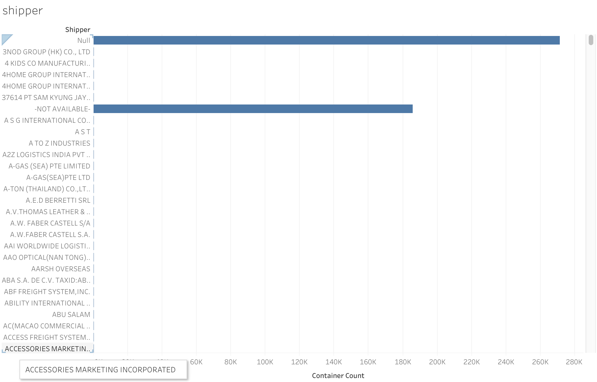
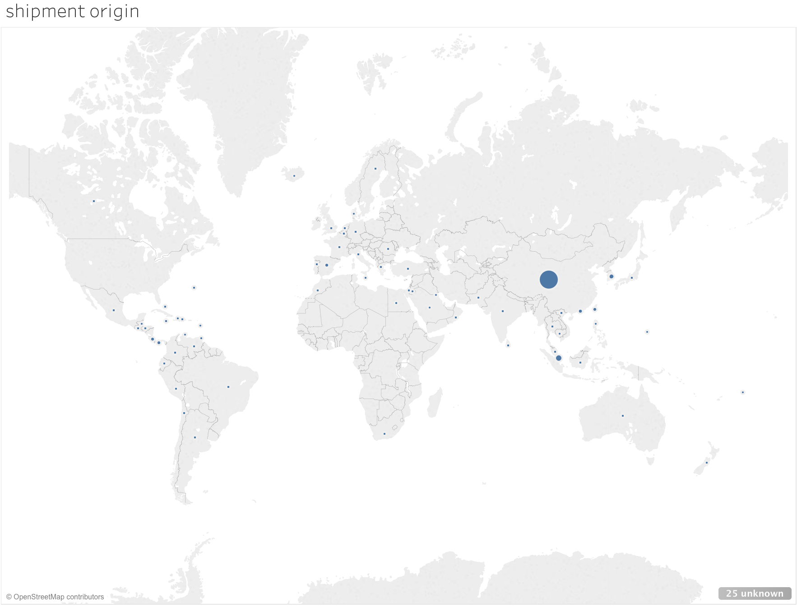
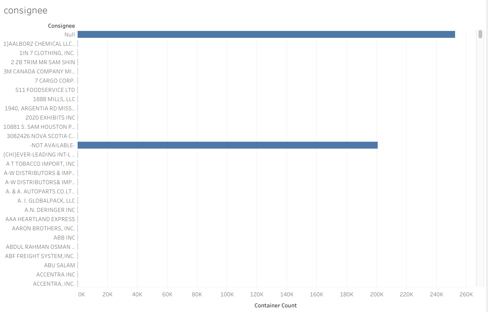

# Supply Chain for Walmart Imports
* Objective is to forecast the imports of goods from overseas consignees and optimize the routing

## 1 - Data, Data Source, Description
* Data relating to the import of goods from overseas
* 159MB of data
* https://ckannet-storage.commondatastorage.googleapis.com/2013-10-19T17:21:30.156Z/walmart-import-data-full.csv
* Dataset column names -> ['SHIPPER ADDRESS', 'CONSIGNEE', 'CONSIGNEE ADDRESS', 'ZIPCODE', 'NOTIFY', 'NOTIFY ADDRESS', 'BILL OF LADING', 'ARRIVAL DATE', 'WEIGHT (LB)', 'WEIGHT (KG)', 'FOREIGN PORT', 'US PORT', 'QUANTITY', 'Q.UNIT', 'MEASUREMENT', 'M.UNIT', 'SHIP REGISTERED IN', 'VESSEL NAME', 'CONTAINER NUMBER', 'CONTAINER COUNT', 'PRODUCT DETAILS', 'MARKS AND NUMBERS', 'COUNTRY OF ORIGIN', 'DISTRIBUTION PORT', 'HOUSE vs MASTER', 'MASTER B/L', 'CARRIER CODE', 'CARRIER NAME', 'CARRIER ADDRESS', 'CARRIER CITY', 'CARRIER STATE', 'CARRIER ZIP', 'PLACE OF RECEIPT']

## 2 - Objective of Forecasting
* Forecast import levels for 2014 based on data from 2012 to 2013

## 3 - Objective for Optimization
* Minimize overall COUNT of imports from same CONSIGNEE while maximising WEIGHT/QUANTITY per import

Demand :

1. Walmart Demand from the supplier for selling items

Forecasting:
1. Forecast the demand based on past data
2. Causal analysis for change in demand

Optimization:
1. Optimization for Routing
2. Optimization for Time/Cost

Inventory:
1. Design of inventory

Task:
1. Analysing the data
2. Report/Dashboard
3. Routing and Optimization
4. Simulation of schenarios
5. Coding

#Responsibilities

1. Inventory Management - mock the inventory data --> Jiayi 
2. Demand Forecast - sales data forcasting --> Gaelan
3. Transport/Routing and Scheduling --> Abhilasha
4. Warehouse Optimization - warehouse data --> Ashok 
5. Maintenance / reverse logistic - data --> Sunil

https://www.google.com.sg/maps/search/Pittsburgh,+walmart/@40.4560713,-80.1151148,11z?hl=en

## Analysis
----
0. Routing

1. Shipment 

    Lots of missing information
    
    

2. Visualization for origin
    
    

    As can seen, Majority of the shipment is from **China**!!! 

3. Cosignees data
    
    
    
    
    
## Summary
-----

1. What can we do with data ?
2. What can be interpreted with missing data ?
